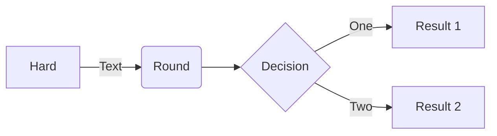

# Markdown

For more information regarding markdown, refer to [Markdown](http://daringfireball.net/projects/markdown/).
Note that DocFx supports DocFx flavored markdown, allowing additional things such as creating diagrams (using Mermaid). For more information refer to [DocFx markdown](https://dotnet.github.io/docfx/docs/markdown.html?tabs=linux%2Cdotnet).

## Cross references

It is good practice to add a UID to every markdown file.

```markdown
---
uid: <myTopicUid> 
--- 
```

In the toc.yml file you can then reference a page via this UID using `topicUid`.

```yml
topicUid: markdown
```

To reference another file in a markdown file, you can use xref. 
For example:

```markdown
[Markdown page](xref:markdown)
```

For more information refer to [Links and Cross References](https://dotnet.github.io/docfx/tutorial/links_and_cross_references.html).

## Examples DocFx flavored markdown

### Mermaid diagram


